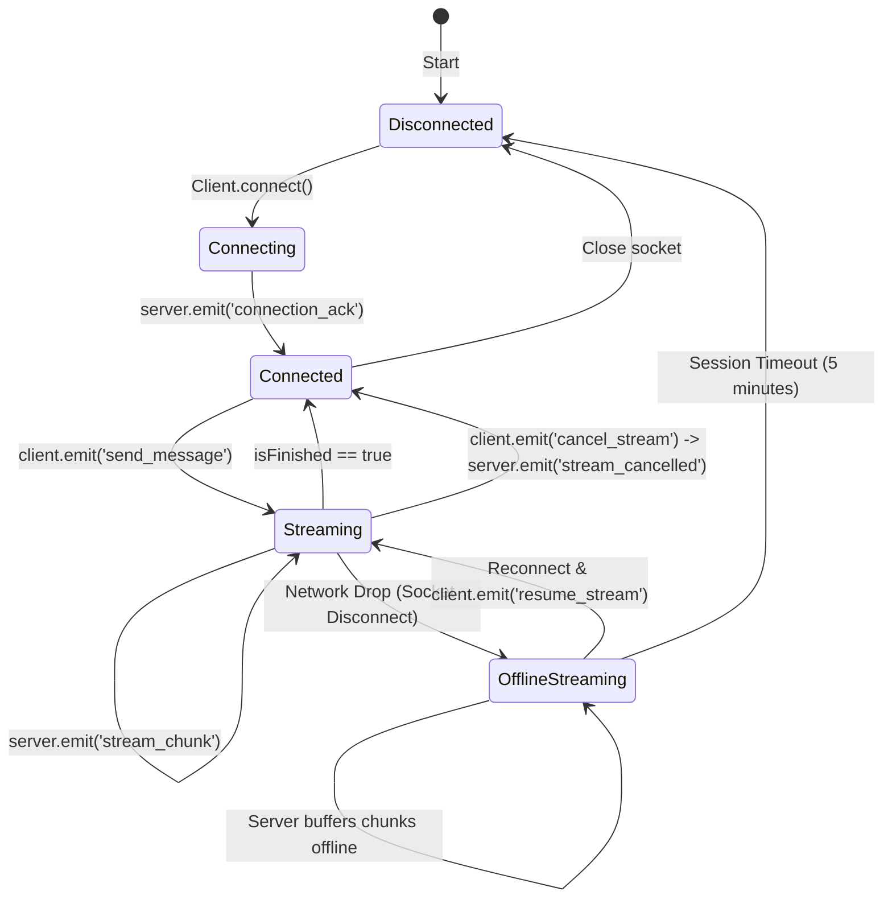

# 📡 WebSocket Protocol Specification: Streaming Chat

This document defines the WebSocket protocol utilized by the **Streaming Chat Prototype** to communicate between the companion clients (iOS, Web) and the NestJS server. It is built on top of the **Socket.io** protocol to leverage robust, built-in network recovery, heartbeat handling, and reconnection out of the box.

---

## 🧭 Connection Lifecycle



---

## 📥 Client-to-Server Events (`client -> server`)

### 1. `send_message`
Initiates a new AI streaming conversation. If a stream is already running for this `sessionId`, it will be force-terminated before starting the new stream.

*   **Payload Format:**
    ```json
    {
      "sessionId": "UUID-string-identifying-user-session",
      "messageId": "UUID-string-identifying-the-specific-bot-response",
      "text": "The message text entered by the user"
    }
    ```
*   **Rate Limits:** **1 message per second per `sessionId`**. Violating this will trigger a `stream_error` event.

### 2. `cancel_stream`
Instantly cancels an active streaming session on the server.

*   **Payload Format:**
    ```json
    {
      "sessionId": "UUID-string-identifying-user-session",
      "messageId": "UUID-string-identifying-the-specific-bot-response"
    }
    ```
*   **Behavior:** The server immediately terminates the generation timer, discards the cached stream buffers from memory, and emits `stream_cancelled`.

### 3. `resume_stream`
Requests resumption of a stream after recovering from a network disconnection.

*   **Payload Format:**
    ```json
    {
      "sessionId": "UUID-string-identifying-user-session",
      "lastReceivedIndex": 14
    }
    ```
*   **Behavior:**
    *   If the session is found in memory, the server updates the socket association, calculates the missing chunk sequence (from `lastReceivedIndex + 1`), **fast-forwards** all missed chunks to the client immediately, and continues streaming live.
    *   If the session has expired or is not found (e.g. after the 5-minute cleanup timeout), the server responds with a `stream_error`.

---

## 📤 Server-to-Client Events (`server -> client`)

### 1. `connection_ack`
Sent immediately upon successful client socket handshake.

*   **Payload Format:**
    ```json
    {
      "status": "connected"
    }
    ```

### 2. `stream_chunk`
Delivers sequential word/token chunks of the streaming answer.

*   **Payload Format:**
    ```json
    {
      "messageId": "UUID-string-identifying-the-response",
      "chunkIndex": 15,
      "text": "Switzerland",
      "isFinished": false
    }
    ```
*   **Frequency:** ~5 words per second (1 chunk every 200ms).
*   **Termination:** The last chunk in the story always carries `isFinished: true`.

### 3. `stream_cancelled`
Acknowledges successful stream cancellation.

*   **Payload Format:**
    ```json
    {
      "messageId": "UUID-string-identifying-the-cancelled-response"
    }
    ```

### 4. `stream_error`
Fired when a request fails or violates server limits.

*   **Payload Format:**
    *   *For Rate Limit/Spam errors:*
        ```json
        {
          "messageId": "msg-s4-spam",
          "error": "Rate limit exceeded. Please wait 1 second between messages."
        }
        ```
    *   *For Session Expiration errors:*
        ```json
        {
          "sessionId": "expired-session-id",
          "error": "Session expired or not found"
        }
        ```

---

## 🛡️ Edge Cases & Production Handling

1.  **Network Drop (Airplane Mode)**:
    *   The server's Socket.io implementation uses rapid heartbeats (`pingInterval: 2000`, `pingTimeout: 2000`) to detect connection drops in real-time.
    *   If a client drops off, the server **does not stop the stream timer**. It continues generating words and buffering them in `sentChunks` memory.
    *   When the client reconnects, they transmit `resume_stream` with their local `lastReceivedIndex`. The server sends the catch-up slice immediately.
2.  **Graceful Session Deletion**:
    *   If a stream finishes successfully, it is kept in memory for **5 minutes** (via `scheduleSessionCleanup`) to allow late reconnects/catch-up, and is then garbage collected.
    *   If a stream is explicitly cancelled by the user via `cancel_stream` or overridden by a new `send_message`, it is **instantly purged** from memory.
